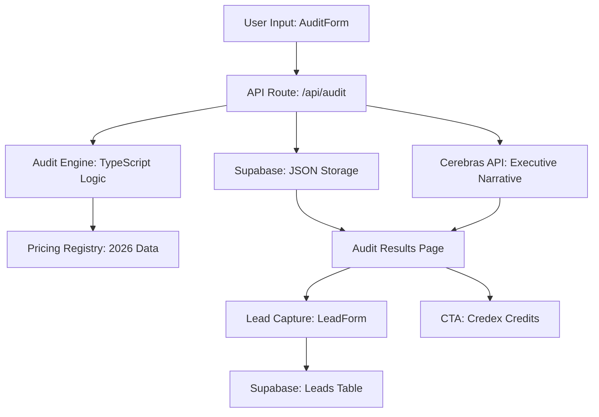

# Architecture Overview: Credex AI Spend Audit

## Stack Definition
- **Framework**: Next.js 14 (App Router)
- **Language**: TypeScript (Strict Mode)
- **Styling**: Vanilla CSS + Tailwind Core (Bespoke Design Tokens)
- **Database**: Supabase (PostgreSQL + Auth)
- **AI Engine**: Cerebras Cloud SDK (llama3.1-8b)
- **Testing**: Vitest (Unit & Logic Testing)

## System Diagram

## System Components

### 1. The Audit Engine (`src/lib/audit-engine.ts`)
The heart of the application. It performs three primary operations:
- **Redundancy Check**: Cross-references IDEs (Cursor/Copilot) and Chat interfaces (ChatGPT/Claude) to find functional overlaps.
- **Billing Optimization**: Analyzes monthly vs. annual spreads to identify quick-win savings.
- **Credex Credit Logic**: Triggers "Credex Infrastructure Credits" recommendations for high-spend entities ($500+ annual savings).

### 2. Data Persistence Flow
1. **Input**: User submits tool usage via `AuditForm`.
2. **Execution**: `runAudit` processes inputs and generates a JSON result.
3. **Persistence**: The result is saved to the `audits` table in Supabase via `POST /api/audit`.
4. **AI Summary**: A background call to Cerebras generates the executive narrative based on the specific audit data.
5. **Retrieval**: The `AuditResultsPage` fetches the stored JSON and displays it with a high-fidelity visualizer.

### 3. Design System (`src/app/globals.css`)
- **Tokens**: Centralized color palette using Emerald-800 for the Credex brand.
- **Typography**: Inter (Sans-serif) for primary UI, JetBrains Mono (Monospace) for all financial figures.
- **Layout**: Grid-based "Institutional" layout with strict spacing and minimalist borders.

## Security & Performance
- **Server-Side Generation (SSG)**: Public audit pages are server-rendered for speed and SEO.
- **Rate Limiting**: API routes are protected to prevent abuse of the Cerebras SDK.
- **Type Safety**: End-to-end TypeScript types for all audit and pricing data.

## Deployment Pipeline
- **CI**: GitHub Actions run linting and unit tests on every PR.
- **Hosting**: Vercel (Edge-optimized).
- **Environment**: Strict separation of Production and Preview environments.

---

## At 10k Audits/Day — What Changes

The current architecture is synchronous and single-instance. At 10,000 audits/day (~7 audits/minute peak), several components would need redesign:

**1. Decouple AI summary generation from the audit submission.**  
Currently, `POST /api/audit` calls the Cerebras API synchronously before returning a response. At scale, this creates a tight coupling where Cerebras latency or rate limits block the entire request. The fix: write the audit result to Supabase immediately and return the `publicId` to the client. A separate queue worker (Inngest, Trigger.dev, or a Supabase Edge Function) processes the AI summary asynchronously. The results page polls or uses a websocket to show the summary when ready.

**2. Edge-cache the results page.**  
Audit result pages (`/audit/[publicId]`) are currently fully dynamic. At scale, a page that's been shared 50 times (viral loop) would hit the database 50 times for identical data. The fix: set `cache: 'force-cache'` or use Next.js `revalidate` to cache the results page at the CDN layer for 1 hour. Audit data is immutable after creation — there's no correctness risk.

**3. Supabase connection pooling.**  
The free-tier Supabase plan uses a direct PostgreSQL connection per request. At 7 req/min this is fine; at 100 req/min it hits connection limits. The fix: switch to the Supabase connection pooler (pgBouncer) and move heavy-read queries to the Supabase REST API (which handles pooling internally).

**4. Rate limiting at the edge.**  
Current rate limiting is in the API route handler (in-memory, per-instance). In a serverless environment, each function instance has its own memory. The fix: use Upstash Redis with the `@upstash/ratelimit` library for a globally consistent rate limit that works across all Vercel function instances.
