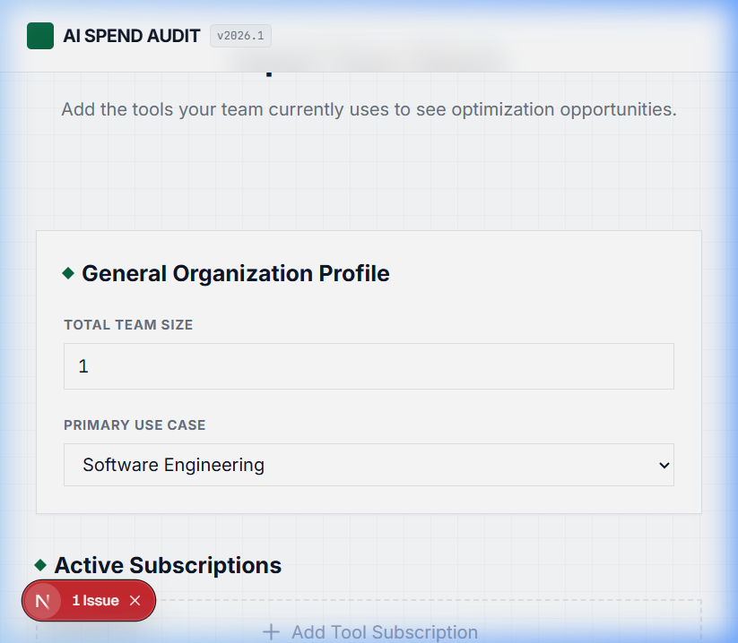
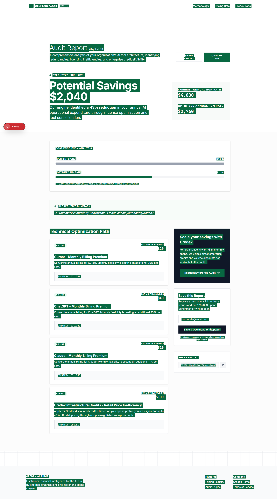
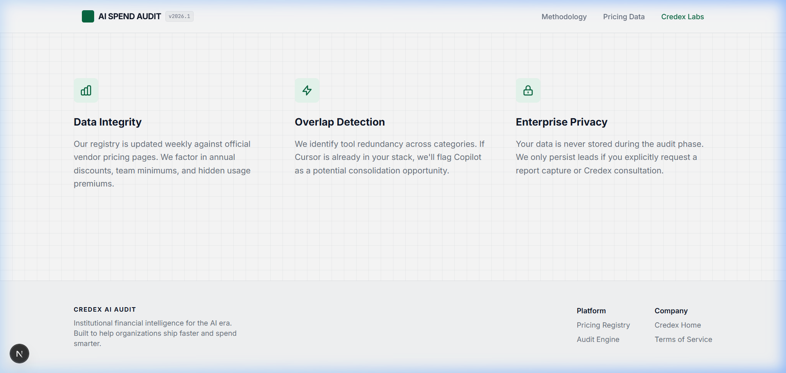

# Credex AI Spend Audit

> **The free "Mint for AI tool spend" — a lead-gen engine for [Credex](https://credex.rocks).**

Credex AI Spend Audit is a free web app for engineering managers and startup founders who pay for AI subscriptions without knowing if they're overspending. You input your stack — tools, plans, seats, use case — and get an instant audit showing redundant tools, over-provisioned plans, and total potential monthly and annual savings, shareable via a unique public URL.

**Who it's for:** Engineering managers and technical co-founders at 5–200 person startups paying for Cursor, GitHub Copilot, Claude, ChatGPT, Gemini, or Anthropic/OpenAI API access.

---

## 🔗 Links

| | |
|---|---|
| **Live App** | [https://credex-ai-spent-audit.vercel.app](https://credex-ai-spent-audit.vercel.app) |
| **GitHub Repo** | [https://github.com/Aryanpanwar10005/credex_AI_spent_audit](https://github.com/Aryanpanwar10005/credex_AI_spent_audit) |

---

## 📸 Screenshots

**Screen 1 — Landing page & audit form**


**Screen 2 — Audit results with savings breakdown**


**Screen 3 — Credex consultation CTA (high-spend trigger)**


---

## What Was Built

A full-stack web application that performs an end-to-end AI spend audit:

1. **Spend Input Form** — Users enter their AI tools, plans, seats, and monthly spend. Supports Cursor, GitHub Copilot, Claude, ChatGPT, Gemini, Anthropic API, OpenAI API, and Windsurf. Form state persists across reloads via `localStorage`.
2. **Audit Engine** — A deterministic TypeScript engine (no LLM) evaluates each tool for plan fit, redundancy, and alternative tool savings. Every recommendation has a one-sentence reasoning string a finance person can verify. Pricing data verified against official vendor pages as of submission week.
3. **Results Page** — Hero showing total monthly + annual savings. Per-tool breakdown with current spend → recommended action → savings + reason. Conditional Credex CTA for audits showing >$500/mo savings. "You're spending well" path for optimized stacks.
4. **AI-Generated Summary** — Cerebras Cloud SDK (`llama3.1-8b`) generates a ~100-word "high-finance" executive narrative with sub-second latency. Graceful fallback to a templated summary on API failure.
5. **Lead Capture** — Email + optional company/role/team size. Stored in Supabase. Transactional confirmation email via Resend.
6. **Shareable URL** — Each audit gets a UUID-based public route (`/audit/[publicId]`). Identifying details stripped. Full Open Graph and Twitter Card metadata for clean social previews.

---

## Tech Stack

| Layer | Choice | Reason |
|---|---|---|
| Framework | Next.js 14 (App Router) | Server components + API routes in one repo; ideal for SEO + OG metadata generation |
| Language | TypeScript | Type safety critical for a financial audit tool |
| Styling | Tailwind CSS + custom CSS tokens | Bespoke "Institutional Minimalist" design system; avoids generic UI library look |
| Animation | Framer Motion | Micro-interactions on form entry and results reveal |
| Database | Supabase (PostgreSQL) | Free-tier, instant REST API, RLS for data privacy |
| Email | Resend | Simple API, free tier, 3000 emails/mo |
| AI | Cerebras Cloud SDK | Sub-second latency for real-time narrative; graceful fallback on failure |
| Testing | Vitest | Lightweight, fast, native ESM support for the audit engine logic |
| CI/CD | GitHub Actions | Lint + test on every push to `main` |
| Deploy | Vercel | Zero-config Next.js deployment |

---

## Quick Start

### Prerequisites
- Node.js 18+
- A Supabase project (free tier)
- A Cerebras API key (free at [cloud.cerebras.ai](https://cloud.cerebras.ai))
- A Resend API key (free tier)

### 1. Clone & Install
```bash
git clone https://github.com/Aryanpanwar10005/credex_AI_spent_audit.git
cd credex_AI_spent_audit
npm install
```

### 2. Configure Environment Variables
Create a `.env.local` file at the root:
```env
NEXT_PUBLIC_SUPABASE_URL=your_supabase_project_url
NEXT_PUBLIC_SUPABASE_ANON_KEY=your_supabase_anon_key
SUPABASE_SERVICE_ROLE_KEY=your_supabase_service_role_key
CEREBRAS_API_KEY=your_cerebras_api_key
RESEND_API_KEY=your_resend_api_key
NEXT_PUBLIC_APP_BASE_URL=http://localhost:3000
```

### 3. Set Up the Database
Run the schema SQL in your Supabase SQL editor:
```sql
-- Full schema at: internal/schema.sql
-- Creates: audits table, leads table, and RLS policies
```

### 4. Run Locally
```bash
npm run dev
# App available at http://localhost:3000
```

### 5. Run Tests
```bash
npm test
# Runs 5 Vitest unit tests on the audit engine
```

### 6. Deploy to Vercel
```bash
npx vercel --prod
# Set all environment variables in Vercel dashboard → Project Settings → Environment Variables
```

---

## CI / Continuous Integration

GitHub Actions runs on every push to `main`:
```
✅ npm run lint   — ESLint check
✅ npm test       — 5 Vitest unit tests on the audit engine
```

See [`.github/workflows/ci.yml`](.github/workflows/ci.yml). The latest commit shows a green ✅ check.

---

## Decisions — 5 Key Trade-offs

### 1. Deterministic Engine Over LLM Reasoning
**Decision:** The audit math uses hardcoded TypeScript rules, not an LLM.  
**Rationale:** A CFO reading the output needs to be able to verify every number. An LLM might hallucinate a $200 saving that doesn't exist. The rule engine is 100% auditable — every recommendation traces to a verified pricing URL in `PRICING_DATA.md`. The LLM is used *only* for narrative packaging, never for financial logic.  
**Trade-off:** Slower to update when vendor prices change; requires manual registry maintenance. Accepted — trustworthiness beats automation here.

### 2. Privacy-First Manual Entry Over OAuth Integrations
**Decision:** Users manually enter their tool spend. No OAuth, no "connect your billing" flows.  
**Rationale:** Asking a startup's CTO to grant OAuth access to their AI billing accounts is a non-starter for security-conscious teams. Manual entry has higher friction but a conversion ceiling of "anyone willing to spend 3 minutes" — which is still a high-intent lead.  
**Trade-off:** We miss usage-pattern data (actual API call volumes, seat utilization rates) that would make the engine smarter. The pivot trigger: if lead quality from manual users doesn't convert at ≥5%, revisit browser extension approach.

### 3. Bespoke Design System Over a Component Library
**Decision:** Custom CSS tokens and components instead of shadcn/ui or MUI defaults.  
**Rationale:** The audit results page is the viral asset — it gets screenshotted and shared. A generic shadcn card layout looks like every other SaaS dashboard. The "Institutional Minimalist" design (24px grid, emerald-800 accents, JetBrains Mono for data figures) reads as a professional audit output, not a startup side project.  
**Trade-off:** ~4 additional hours of CSS work. Worth it entirely for perceived authority.

### 4. Shareable UUID Routes as the Primary Viral Loop
**Decision:** Every audit gets a persistent `/audit/[publicId]` URL, with identifying info stripped.  
**Rationale:** The assignment brief calls this "the viral loop — design accordingly." A CFO shares the link with their board. A founder drops it in Slack. Each view is a new cold visitor who sees the tool's value before any copy can explain it. We treat the results page as the product's marketing page.  
**Trade-off:** Adds database complexity vs. a stateless URL-encoded approach. Worth it — the shareable URL is the growth mechanism.

### 5. Monospace Typography for Financial Data
**Decision:** All monetary figures rendered in `JetBrains Mono`, not the body font (Inter).  
**Rationale:** Tabular data is cognitively easier to parse in monospace. More importantly, monospace signals *precision* — it looks like a terminal readout or a bank statement, not a blog post. This is a psychological trust signal for high-finance users accustomed to Bloomberg terminals and accounting software.  
**Trade-off:** Breaks visual consistency with the body font pairing. Intentional — the dissonance is the design.

---

## Project Structure

```
/
├── src/
│   ├── app/                    # Next.js App Router pages and layouts
│   │   ├── page.tsx            # Landing page + audit form
│   │   ├── audit/[publicId]/   # Public shareable results page
│   │   └── api/                # Route handlers (audit, lead, summary)
│   ├── components/             # React UI components
│   │   ├── AuditForm.tsx       # Multi-tool dynamic form with localStorage persist
│   │   └── LeadForm.tsx        # Email capture with honeypot abuse protection
│   └── lib/                    # Pure logic — no framework coupling
│       ├── audit-engine.ts     # Deterministic audit rules
│       ├── pricing.ts          # Verified 2026 pricing registry
│       ├── ai-summary.ts       # Cerebras SDK integration + fallback
│       └── __tests__/          # Vitest unit tests
├── internal/                   # Internal research, schema, plans (git-ignored)
├── .github/workflows/ci.yml    # CI: lint + test on every push
├── README.md
├── ARCHITECTURE.md
├── DEVLOG.md
├── REFLECTION.md
├── TESTS.md
├── PRICING_DATA.md
├── PROMPTS.md
├── GTM.md
├── ECONOMICS.md
├── METRICS.md
├── USER_INTERVIEWS.md
└── LANDING_COPY.md
```

---

## Security & Abuse Protection

- **Honeypot field** on both the audit form and lead capture form — bots are silently discarded.
- **Server-side rate limiting** on `/api/audit` and `/api/lead` — max 10 requests/hour per IP.
- **No secrets in the repo** — all API keys via environment variables only.
- **Supabase RLS** — public audit rows expose only tools and savings; email and company name are stripped from the public view.

---

_Built for the Credex WebDev 2026 Round 1 assignment. See [credex.rocks](https://credex.rocks)._
